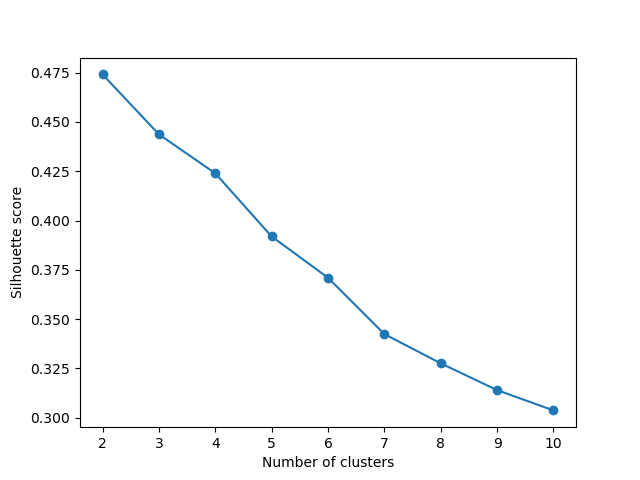
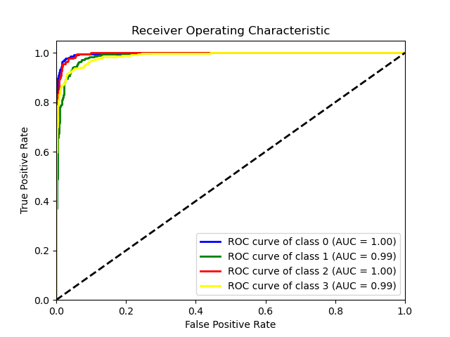

## **文本的爬取、清洗、打标、分类、特征回归**

异步爬虫爬取腾讯云千帆市场等产品数据，清洗后获取5632个有效样本。经过w2v转换为120维embedin_后，利用LOF剔除43个离群点，通过 k-means聚类和HDF对数据产品分类框架进行验证，并训练了能够准确识别新数据产品类别的TextCNN模型，Accuracy为91%，AUC达到0.98，最后通过TF-IDF算法进行矩阵变换，将关键词语义表征纳入异方差下的前向逐步回归模型，构建数据产品的定价特征模型， R²为0.56，统计学与经济学含义均显著。

## **Environment setup**

My device：Linux，PyTorch version 2.1.2+cu121

**1. 首先，请安装相关依赖**
```shell
pip install -r requirement.txt
```
**2.  执行**
```shell
python main.py
```
请将spyder的headers和proxies修改为自己的设备

**3.  结果**



